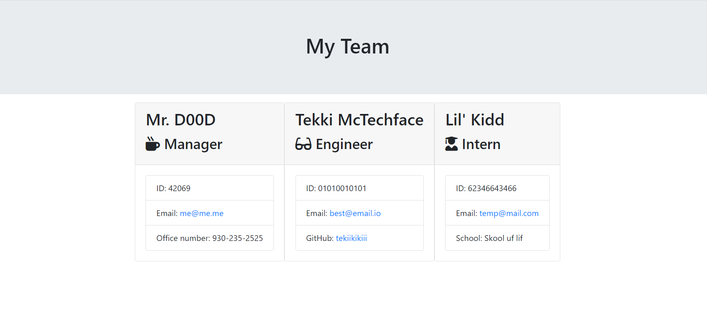

 
    # Employ Profile Generator 
   
    This program generates an employed profile webpage based on your input. There are three employee types: manager, engineer, and intern.
    
* [Installation](#Installation)
    
* [Instructions](#Usage)
    
* [License](#License)
       
    ## Installation
    Download and go to the folder in your node terminal.
    ## Instructions
    While having node.js installed and this folder selected, type "node app.js" into the terminal. Answer the prompts given to you. A video of this program being used can be found at: https://youtu.be/clR2ZLyNtjs

    ## License 
    This project is licensed under the MIT license
    - Email: timiholzer@gmail.com - GitHub Repo: https://github.com/timholzer/HW10
    